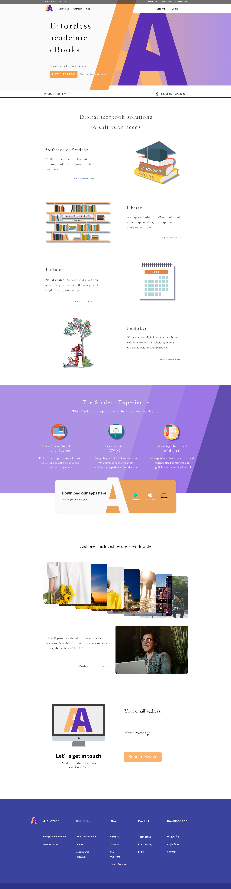
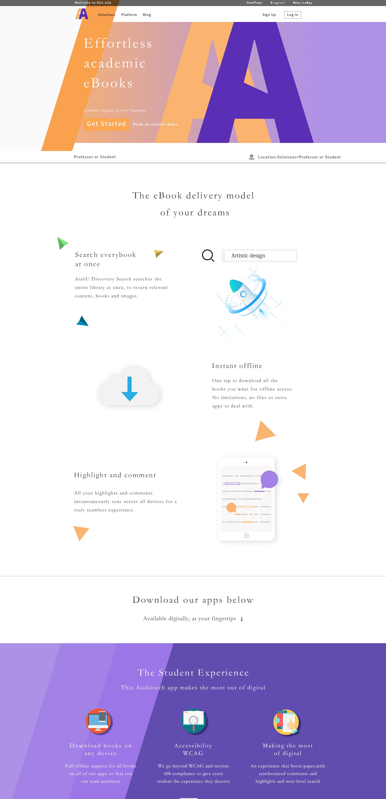
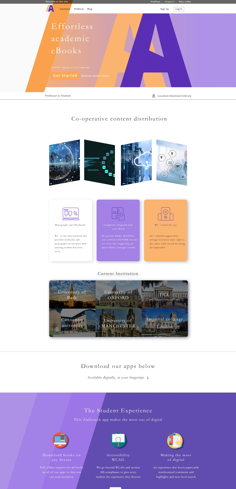
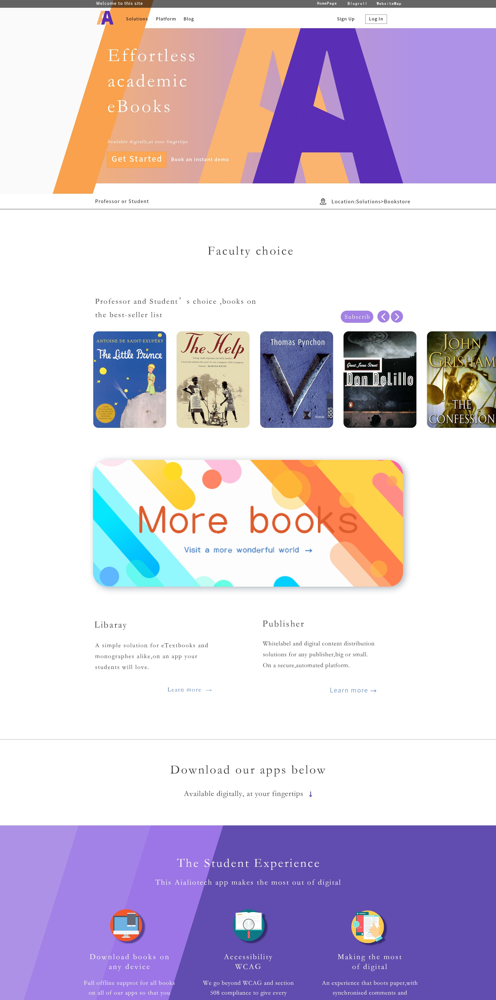
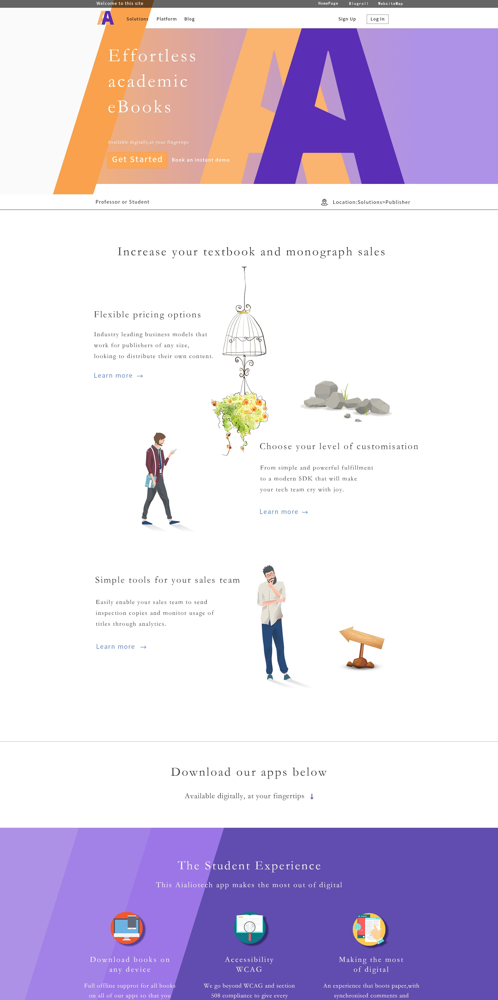

# DOUBLEA电子书城

---

> 本项目为网页设计课程的结课大作业

#### 1.主页的设计与实现？

主页的设计主要可以归纳为5个部分的设计：

1. 包括网站LOGO设计
2. 顶部导航栏top区导航设计
3. 横幅banner区设计
4. 主页主体区板块设计
5. 底部区设计

详细设计过程：

##### （1）Step1：确定网页风格：

确定网页风格、设计主题内容：电子书app介绍、优势功能等。

##### （2）Step2：搭建网页主页框架：

搭建网页主页框架、top顶部区1920*800像素

1. 设计顶部欢迎栏采用黑色不透明度为70%悬浮设计、登陆和注册点击框居右，登陆使用黑色矩形描边突出，网站LOGO居右，导航动态效果设计：当浏览者下滑时导航栏将自动悬浮于顶部实时点击。
2. 主页LOGO，采用简约双AA设计强调主体，简约的LOGO设计更能使消费者容易记住产品app，配色采用（辅色）橘黄色与（主色）熏衣紫色暖色调设计，更能够拉进电子书籍学习主题与使用者之间的距离。
3. 设计横幅banner，大图LOGO位于网页主位置，融入LOGO元素（包括配色、LOGO再现）加深记忆、利于产品推广，banner配色为LOGO颜色渐变，使网页元素更具关联性、一体化，点击Get Start选项将自动下滑至下载区，便于浏览者快捷选择下载。
4. banner交互设计：主页banner制作使LOGO呈现一种立体突出（帘布与橘黄色A联结在一起）的效果，当转入内页帘幕将打开，LOGO更近距离（LOGO放大）的展现在眼前。

##### （3）Step3： 设计栏目板块区域

1. 包括了LOCATION（当前位置）板块和Professor or Student、Libaray、Bookstore、 Publisher四个主要内容板块，分别写入相关主要内容简要介绍，制作了对应的Learn more快捷链接，方便网站浏览者浏览。该板块的文字统一采用了华文楷体，使页面更具有观赏性和艺术性，起到了美化页面的作用。提高浏览者停留的意愿和时长，提升产品相关内容品质和质量。
2. 设计The Student Experience使用者经验和反馈板块、Download our app多平台下载（下载区配色与LOGO配色相一致，使下载链接更加明显，中间由橙黄色到白色转变低调融入LOGO元素，再次强化了消费者对app的记忆）。交互效果：背景采用倾斜渐变色设计，主体渐变色变化位于页面靠右侧。当浏览者进入内页时，渐变背景将出现一个左滑移动效果，深紫色区域面积增加，动态化的页面让页面浏览更具有趣味性。
3. 设计Aialiotech is loved by users worldwide板块（采用多组照片悬浮式外滑交互设计，当浏览者鼠标移动到相关内容照片，照片将向向外滑动，能够在更小的区域内使浏览者看到更多的内容，增加了浏览者的页面浏览体验）。
4. 设计与开发人员联系Contact us板块，Let’s contact 采用字体采用黑体强调主题，并且左边再次融入LOGO元素，强化消费者对制作团队与产品app之间的联想，右侧为email地址与信息的输入框，简洁的设计使浏览者更愿意想工作人员提出想法和建议。
5. 底部导航板块设计：底部mini导航简洁、清晰明了、使浏览者无须点击顶部导航，从而更快的切换到感兴趣的板块。同时再次融入LOGO元素，深化消费者对产品app的印象。

#### 2.内页的设计与实现？

内页设计与主页采用统一的设计风格，但统一中又有着一些变化。

使内页的阅读不再单调，如banner的细节变化、LOGO方法拉进浏览者与产品的距离。位置导航相应的发生变化。

1. The Student Experience板块大体保持不变，但背景同色系渐变色有一个相左移动的效果。给浏览者一种打开了页面的内部的视觉体验。
2. 栏目板块内容页设计1：Professor or Student，版式布局采用文字+配图的排版布局，并且三组文字+图片错开布局。使页面内容具有一种错落没，三组图文之间采用纸飞机、橙色正三角点缀，使不同组内容之间加强视觉上的互动和联系感。页面中的配图均为自己制作，使用ps或者ai工具。
3. 栏目板块内容页设计2：Libaray，该内页最前一行版式布局采用了四个矩形斜切后的排列布局，对称的分布开，内容具有科技感与上一页内容呼应，中间栏强调优势，配色再次采用LOGO配色，白色+紫色+橙黄色。所有矩形均为圆角矩形，更加柔和、温馨投影效果使页面更加立体化。其中的三个图标均为AI设计制作。后最后一栏的current Institution采用具体配图加上黑色矩形不透明度为50%的效果，突出白色文字制作。
4. 栏目板块内容页设计3： Bookstore，同样大量使用圆角矩形使得页面更加柔和，第一栏采用滚动式翻阅设计，浏览者点击右上角按钮就可以查看或者选择订阅书籍。中间部分为一个整体可点击悬浮矩形（more books）进入书库的按钮。彩色图形为使用Ps设计，最后一行是相关连接的返回上一栏和进入下一栏的快捷点击。
5. 栏目板块内容页设计4：Publisher确保内页内容的完整性，最后只做了Publisher板块，排版布局与主页内容相呼应，同样采用了左文右图or右文左图的设计，加上一些细节上的修饰。内容包括Flexible pricing options、Choose your level of customisation、Simple tools for your sales team以及相应的更多learn more点击快捷可点击链接。

#### 3.页面效果展示

##### （1）index首页：

##### （2）page1内页：

##### （3）page2内页：

##### （4）page3内页：

##### （5）page4内页：

#### 4.关于其他问题

页面中使用的LOGO和图标都是由自己使用PS或者AI工具设计并绘制，大部分图标使用AI制作，

某些图标如AppleLOGO为钢笔绘制，具体细节见AI图标文件夹。

页面效果与内容参考相关链接https://bibliu.com/，

