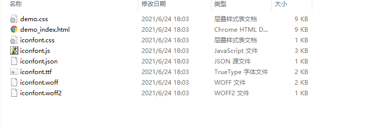
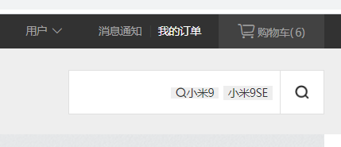
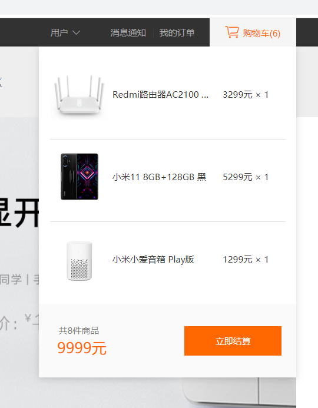
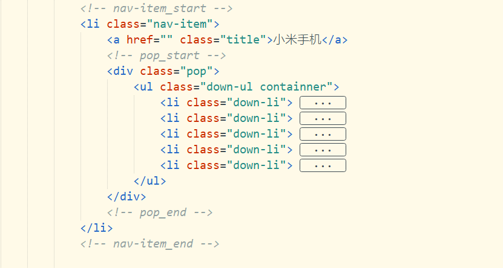
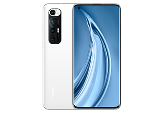
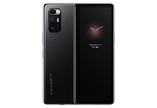
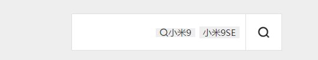
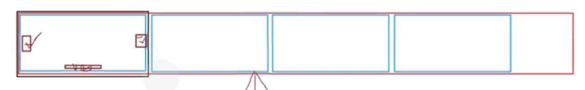
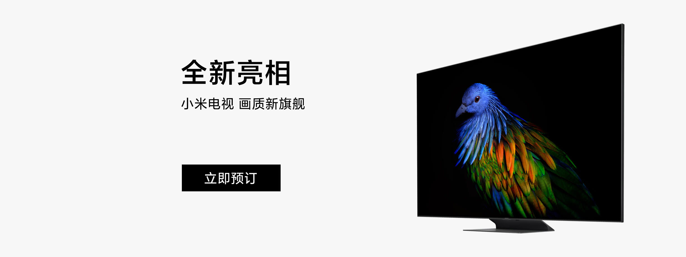
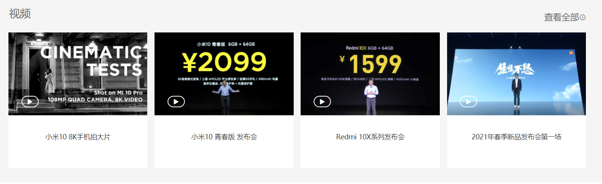

# 小米商城

------

### 一、准备工作

#### 1.分析页面

##### （1）设计图大小：

版芯宽度：1200px、1100px、960px

设计图大小：高度不确定、宽度为1920px

##### （2）公共部分：

头部header、底部footer、导航nav都为公共部分

##### （3）页面中相同的布局：

例如1：


例如2：


例如3：


#### 2.图标和字体图标技术：

##### （1）图标：

就是使用背景图片或图片来制作的，一般为png格式

```html
<!DOCTYPE html>
<html lang="zh">
<head>
	<meta charset="UTF-8">
	<title>背景图片的基本使用</title>
	<style type="text/css">
		.box {
			width: 30px;
			height: 30px;
			border: 1px solid blue;
			background: url(img/index.png) left top no-repeat;
			background-size: 30px 30px;
		}
		.box:hover {
			background-color: #eee;
			background-image: url(img/index-on.png);
		}
	</style>
</head>
<body>
	<div class="box"></div>
</body>
</html>
```


##### （2）字体图标：

本质是一种特殊字体，将图片变成字体。可以通过font-size来控制字体的大小、color控制字体颜色。

现在基本都是使用字体图标，字体图标能够保证图标的清晰度。（阿里巴巴矢量图标库）

###### step1文件下载：

在阿里巴巴矢量图标库添加相应的图标至项目，点击下载至本地后解压出font文件




注意：具体使用方法见demo_index.html文件中的说明

###### step2文件分析：

字体图标的主要主体内容在名为iconfont.css的文件中，具体分析如下：


###### step3字体图标的使用：

将下载解压的文件夹改名为font，并添加到项目中如下：


在主页html文件中使用字体图标：

```html
<!DOCTYPE html>
<html lang="zh">
<head>
	<meta charset="UTF-8">
	<title>字体图标的基本使用</title>
	<!-- 1.引入自定义的iconfont.css文件 -->
	<link rel="stylesheet" type="text/css" href="font/iconfont.css"/>
	<style type="text/css">
		.box {
			width: 30px;
			height: 30px;
			border: 1px solid blue;
			background: url(img/index.png) left top no-repeat;
			background-size: 30px 30px;
		}
		.box:hover {
			background-color: #eee;
			background-image: url(img/index-on.png);
		}
		/* 4.类似字体样式的书写，对图标的样式进行自定义 */
		span {
			color: red;
		}
		b {
			color: green;
		}
	</style>
</head>
<body>
	<div class="box"></div>
	<!-- 2.字体图标的引入方法1：对span标签书写class属性 -->
	<span class="iconfont icon-yonghu"></span>
	<!-- 3.字体图标的引入方法2：使用Unicode编码进行引入 -->
	<b class="iconfont">&#xe68b;</b>
</body>
</html>
```


### 二、代码编写

#### 1.项目准备工作

##### （1）关于img文件夹

img文件夹通常可细分为icons文件夹和images文件夹

对于icons文件夹下的文件通常长期不会改变，无须经常更换

对于images文件夹下的文件（一般为商品信息图片等），经常需要更换

##### （2）关于css文件夹

css样式文件可分为reset.css文件（处理默认样式）、公共的css样式文件（通常为网页头部和尾部）、

单独的页面css文件（针对页面单独书写的css文件）

如果有其他页面也可以书写其他页面的css文件（其他页面的css文件）


#### 2.页首部分.page-top：


##### （1）top-left:


```html
<!-- top-left_start -->
<ul class="top-left">
	<li><a href="#">小米商城</a></li>
	<li><span>|</span></li>
	<li><a href="#">MIUI</a></li>
	<li><span>|</span></li>
	<li><a href="#">IoT</a></li>
	<li><span>|</span></li>
	<li><a href="#">云服务</a></li>
	<li><span>|</span></li>
	<li><a href="#">天星数科</a></li>
	<li><span>|</span></li>
	<li><a href="#">有品</a></li>
	<li><span>|</span></li>
	<li><a href="#">小爱开放平台</a></li>
	<li><span>|</span></li>
	<li><a href="#">企业团购</a></li>
	<li><span>|</span></li>
	<li><a href="#"> 资质证照</a></li>
	<li><span>|</span></li>
	<li><a href="#">协议规则</a></li>
	<li><span>|</span></li>
	<li class="download">
		<a href="#">
			下载app
			<b></b>
			<div class="down-box">
				
				<i>小米商城app</i>
			</div>
		</a>
	</li>
	<li><span>|</span></li>
	<li><a href="#">智能生活</a></li>
	<li><span>|</span></li>
	<li><a href="#">Select Location</a></li>
</ul>
<!-- top-left_end -->
```

```css
/************************************************ 2.1顶部左侧css样式 ***************************************/
.page-top .top-left {
	color: #a2a2a2;
	line-height: 38px;
	float: left;
}
.page-top .top-left li {
	float: left;
	padding: 0 2.5px;
	display: inline-block;
}
.page-top .top-left li span {
	color: #3f3f3f;
}
.page-top .top-left li:hover a {
	color: #fff;
}
/********************************************* 2.1.1顶部左侧downbload模块css样式 *********************************/
.page-top .top-left .download {
	position: relative;
	z-index: 1000;
}
.page-top .top-left .download b {
	width: 20px;
	height: 11px;
	position: absolute;
	background-image: url(../img/others/三角形.png);
	left: 50%;
	margin-left: -10px;
	top: 28px;
	display: none;
}
.page-top .top-left .download .down-box {
	width: 126px;
	height: 0;
	overflow: hidden;
	background-color: #fff;
	position: absolute;
	left: 50%;
	margin-left: -63px;
	top: 38;
	box-shadow: rgb(170, 170, 170) 0px 1px 5px;
	text-align: center;
	transition: height 0.3s ease;
}
.page-top .top-left .down-box img {
	width: 88px;
	height: 88px;
	display: block;
	margin: 20px auto 0;
}
.page-top .top-left li.download i {
	font-style: normal;
	color: #323232;
	font-size: 13px;
}
.page-top .top-left li.download:hover b {
	display: block;
}
.page-top .top-left li.download:hover .down-box {
	height: 145px;
}
```

##### （2）top-right:


```html
<!-- userinfo_start -->
<div class="userinfo">
	<div class="user">
		<a href="#" class="title">用户<i class="iconfont icon-xiangxia"></i></a>
		<ul>
			<li><a href="#">个人中心</a></li>
			<li><a href="#">评价晒单</a></li>
			<li><a href="#">我的喜欢</a></li>
			<li><a href="#">小米账号</a></li>
			<li><a href="#">退出登录</a></li>
		</ul>
	</div>
	<a href="#" class="link">消息通知</a>
	<span>|</span>
	<a href="#" class="link">我的订单</a>
</div>
<!-- userinfo_end -->
```

###### <1>用户部分userinfo>user：


```css
/******************************************** 2.2.2顶部右侧模块2:userinfo>用户_样式 ********************************/
.page-top .top-right .userinfo {
	float: right;
	margin-right: 20px;
}
.page-top .top-right .userinfo .user {
	width: 120px;
	display: inline-block;
	position: relative;
	z-index: 1000;
}
.page-top .top-right .userinfo .user .title {
	position: relative;
	/* a标签转为块元素 */
	display: block;
	line-height: 38.4px;
	text-align: center;
	color: #a2a2a2;
	z-index: 5;
}
.page-top .top-right .userinfo .user .title i {
	font-size: 10px;
	position: relative;
    left: 5px;
}
.page-top .top-right .userinfo .user ul {
	position: absolute;
	width: 120px;
	height: 0;
	overflow: hidden;
	left: 0;
	top: 38px;
	background-color: #fff;
	transition: all 0.2s ease;
}
.page-top .top-right .userinfo .user ul li {
	padding: 2px 0;
	height: 30px;
	line-height: 30px;
	text-align: center;
}
.page-top .top-right .userinfo .user ul li a {
	display: block;
}
.page-top .top-right .userinfo .user:hover .title {
	color: #ff6700;
}
.page-top .top-right .userinfo .user:hover {
	background-color: #fff;
}
.page-top .top-right .userinfo .user:hover ul {
	height: 170px;
	box-shadow: 0px 5px 8px rgb(0, 0, 0, 0.15);
}
.page-top .top-right .userinfo .user ul li:hover {
	background-color: #f5f5f5;
	color: #ff6700;
}
```

###### <2>消息通知/我的订单部分userinfo>link：



```css
/******************************************** 2.2.3顶部右侧模块3:userinfo>消息通知、我的订单_样式 ******************************/
.page-top .top-right .userinfo .link {
	line-height: 38px;
	color: #a2a2a2;
}
.page-top .top-right .userinfo span {
	padding: 0 3px;
	color: #3f3f3f;
}
.page-top .top-right .userinfo .link:hover {
	color: #fff;
}
```

###### <3>购物车部分cart-box：



```html
<!-- cart-box_start -->
<div class="cart-box">
	<a href="#" class="title">
		<i class="iconfont icon-ziyuan"></i>
		<span>购物车(6)</span>
	</a>
	<!-- pop_start -->
	<div class="pop">
		<ul class="list">
			<li class="list-item">
				<div class="detail">
					<a href="">
						
						<span>Redmi路由器AC2100 白色</span>
					</a>
				</div>
				<div class="price">
					<i class="iconfont icon-guanbi"></i>
					<span>3299元 × 1</span>
				</div>
			</li>
			<li class="list-item">
				<div class="detail">
					<a href="">
						
						<span>小米11 8GB+128GB 黑</span>
					</a>
				</div>
				<div class="price">
					<i class="iconfont icon-guanbi"></i>
					<span>5299元 × 1</span>
				</div>
			</li>
			<li class="list-item">
				<div class="detail">
					<a href="">
						
						<span>小米小爱音箱 Play版</span>
					</a>
				</div>
				<div class="price">
					<i class="iconfont icon-guanbi"></i>
					<span>1299元 × 1</span>
				</div>
			</li>
		</ul>
		<div class="total">
			<div class="sum">
				<span>共8件商品</span>
				<h3>9999元</h3>
			</div>
			<a href="#" class="btn">立即结算</a>
		</div>
	</div>
	<!-- pop_end -->
</div>
<!-- cart-box_end -->
```

```css
/******************************************** 2.3顶部右侧购物车模块css样式 *********************************/
.page-top .top-right .cart-box {
	float: right;
	position: relative;
	z-index: 1000;
}
.page-top .top-right .cart-box .title {
	/* 将a标签转换为块元素 */
	display: block;
	width: 118px;
	height: 38px;
	background-color: #424242;
	text-align: center;
	line-height: 38px;
	color: #a2a2a2;
	position: relative;
	z-index: 5;/* 处理衔接部分更加融合 */
}
.page-top .top-right .cart-box .pop {
	width: 350px;
	height: 0px;
	overflow: hidden;
	position: absolute;
	top: 38px;
	right: 0;
	box-shadow: 0 2px 10px rgba(0, 0, 0, 0.15);
	background-color: #fff;
	transition: all 0.3s ease;
}
.page-top .top-right .cart-box:hover .pop {
	height: 450px;
}
.page-top .top-right .cart-box:hover .title {
	color: #FF6700;
	background-color: #f5f5f5;
}
/******************************************** 2.3.1顶部右侧购物车模块已经选购商品css样式 *********************************/
.page-top .top-right .cart-box .pop .list {
	padding: 15px 15px 0;
}
.page-top .top-right .cart-box .pop .list .list-item {
	height: 91px;
	padding: 10px 0;
	border-bottom: 1px solid #e0e0e0;
	line-height: 85px;
}
.page-top .top-right .cart-box .pop .list .list-item:last-child {
	border: none;
}
.page-top .top-right .cart-box .pop .list .list-item .detail {
	float: left;
	height: 70px;
	line-height: 80px;
}
.page-top .top-right .cart-box .pop .list .list-item .detail img,
.page-top .top-right .cart-box .pop .list .list-item .detail span {
	float: left;
}
.page-top .top-right .cart-box .pop .list .list-item .detail span {
	width: 140px;
	white-space: nowrap;/* 控制文本不会换行 */
	overflow: hidden;/* 内容溢出部分隐藏 */
	text-overflow: ellipsis;/* 文本溢出部分以省略号形式显示 */
	margin-left: 5px;
	font-size: 12px;
}
.page-top .top-right .cart-box .pop .list .list-item .detail img {
	height: 80px;
	width: 80px;
}
.page-top .top-right .cart-box .pop .list .list-item .price {
	font-size: 12px;
	float: right;
	line-height: 80px;
}
.page-top .top-right .cart-box .pop .list .list-item .price i,
.page-top .top-right .cart-box .pop .list .list-item .price span {
	float: right;
}
.page-top .top-right .cart-box .pop .list .list-item .price i {
	opacity: 0;
	margin-left: 10px;
	font-size: 12px;
	cursor: pointer;
	color: #aaa;
	transition: opacity 0.2s ease;
}
.page-top .top-right .cart-box .pop .list .list-item:hover i {
	opacity: 1;
}
.page-top .top-right .cart-box .pop .list .list-item .detail span:hover {
	color: #ff6700;
}
.page-top .top-right .cart-box .pop .list .list-item .price i:hover {
	color: #333;
}
/******************************************** 2.3.2购物车模块底部总金额css样式 *********************************/
.page-top .top-right .cart-box .pop .total {
	background-color: #fafafa;
	padding: 15px 20px;
/****************** problem6:overfloat属性详细了解，浮动的元素没有高度，高度塌陷4种解决方法 ******************/
	height: 70px;
}
.page-top .top-right .cart-box .pop .total .btn {
	display: block;
	width: 132px;
	height: 40px;
	background-color: #FF6700;
	color: #fff;
	text-align: center;
	line-height: 40px;
	float: right;
	margin-top: 15px;
}
.page-top .top-right .cart-box .pop .total .sum {
	float: left;
	margin: 12px 5px 0;
}
.page-top .top-right .cart-box .pop .total .sum span {
	color: #7e7e7e;
}
.page-top .top-right .cart-box .pop .total .sum h3 {
	font-size: 20px;
	color: #ff6700;
	font-weight: 500;
}
```

#### 3.导航部分：


##### （1）logo部分:


```html
<!-- logo_start -->
<a href="index.html" class="logo"></a>
<!-- logo_end -->
```

```css
/************************************************ 3.1logo部分css样式 ****************************************/
.page-nav .logo {
	display: block;
	width:99px;
	height: 96px;
	float: left;
	background: url(../img/icons/logo-mi2.png) center center no-repeat;
	background-size: 54px;
}
```

##### （2）全部分类导航page-all-nav:


> 难点：两次弹出菜单，三次使用`ul>li`结构


```html

```

```css

```


##### （3）部分分类导航nav-item：


> 难点：一次弹出菜单，两次使用`ul>li`结构




```html
<!-- page-all-nav_start -->
<li class="nav-item" id="page-all-nav">
	<a href="" class="title">全部商品分类</a>
	<!-- slider-nav_start -->
	<div class="slider-nav">
		<!-- slider-ul_start -->
		<ul class="slider-ul">
			<!-- slider-li_start -->
			<li class="slider-li">
				<a href="" class="name">
					<span>手机</span>
					<span>电话卡</span>
					<i class="iconfont icon-xiangyou1"></i>
				</a>
				<div class="slider-pop">
					<a href="" class="pop-li">
						
						<p>Redmi Note 10 Pro</p>
					</a>
					<a href="" class="pop-li">
						
						<p>Redmi Note 10 5G</p>
					</a>
					<a href="" class="pop-li">
						
						<p>小米11 Ultra</p>
					</a>
					<a href="" class="pop-li">
						
						<p>小米11 Pro</p>
					</a>
					<a href="" class="pop-li">
						
						<p>小米11 青春版</p>
					</a>
					<a href="" class="pop-li">
						
						<p>小米11</p>
					</a>
					<a href="" class="pop-li">
						
						<p>Redmi K40 Pro 系列</p>
					</a>
					<a href="" class="pop-li">
						
						<p>Redmi K40</p>
					</a>
					<a href="" class="pop-li">
						
						<p>Note 9 5G</p>
					</a>
					<a href="" class="pop-li">
						
						<p>Note 9 Pro 5G</p>
					</a>
					<a href="" class="pop-li">
						
						<p>Redmi 9A</p>
					</a>
					<a href="" class="pop-li">
						
						<p>Redmi K30S 至尊纪念版</p>
					</a>
				</div>
			</li>
			<!-- slider-li_end -->
            <!-- slider-li_start -->
			<li class="slider-li">
				<a href="" class="name">
					<span>电视</span>
					<span>盒子</span>
					<i class="iconfont icon-xiangyou1"></i>
				</a>
				<div class="slider-pop">
					<a href="" class="pop-li">
						
						<p>Redmi MAX 86 超大屏</p>
					</a>
					<a href="" class="pop-li">
						
						<p>小米透明电视</p>
					</a>
					<a href="" class="pop-li">
						
						<p>Redmi 智能电视 X50 灰色</p>
					</a>
					<a href="" class="pop-li">
						
						<p>Redmi智能电视A50 黑色</p>
					</a>
					<a href="" class="pop-li">
						
						<p>小米电视 ES65 2022款 灰色</p>
					</a>
					<a href="" class="pop-li">
						
						<p>小米电视 EA32 2022款 黑色</p>
					</a>
					<a href="" class="pop-li">
						
						<p>小米电视 EA75 2022款 黑色</p>
					</a>
					<a href="" class="pop-li">
						
						<p>小米电视 ES65 2022款 灰色</p>
					</a>
					<a href="" class="pop-li">
						
						<p>小米全面屏电视 55英寸E55X 灰色</p>
					</a>
					<a href="" class="pop-li">
						
						<p>Redmi 电视条形音箱 黑色</p>
					</a>
					<a href="" class="pop-li">
						
						<p>小米电视 EA75 2022款 黑色</p>
					</a>
					<a href="" class="pop-li">
						
						<p>小米电视 ES65 2022款 灰色</p>
					</a>
				</div>
			</li>
            <!-- slider-li_end -->
		</ul>
		<!-- slider-ul_end -->
	</div>
	<!-- slider-nav_end -->
</li>
<!-- page-all-nav_end -->
```

```css

```


##### （4）搜索框search部分：




```html
<!-- search_start -->
<div class="search">
	<form action="" method="post">
		<input type="text" value="" class="query" />
		<input type="submit" value="" class="btn" />
		<div class="tags">
			<span class="iconfont icon-sousuo">小米9</span>
			<span>小米9SE</span>
		</div>
	</form>
</div>
<!-- search_end -->
```

```css
/************************************************ 3.3搜索部分css样式 ****************************************/
.page-nav .search {
	float: right;
	position: relative;
	margin-top: 24px;
}
/************************************************ 3.3.1搜索query部分css样式 **************************************/
.page-nav .search .query {
	width: 227px;
	height: 48px;
	border: 1px solid #e0e0e0;
	border-right: none;
	outline: none;
	line-height: 48;
	padding-left: 8px;
	float: left;
}
/************************************************ 3.3.2搜索tags部分css样式 ****************************************/
.page-nav .search .tags {
	position: absolute;
	top: 17px;
	right: 58px;
	width: 130px;
	text-align: right;
}
.page-nav .search .tags span {
	line-height: 18px;
	padding: 0 5px;
	background-color: #eee;
	font-size: 12px;
	cursor: pointer;
}
.page-nav .search .tags span:hover {
	background-color: #FF6700;
	color: #fff;
}
/************************************************ 3.3.3搜索btn部分css样式 ****************************************/
.page-nav .search .btn {
	width: 50px;
	height: 50px;
	border: 1px solid #e0e0e0;
	float: left;
	background: #fff url(../img/icons/search.png) no-repeat center center;
	background-size: 16px;
	cursor: pointer;
}
.page-nav .search:hover .query,
.page-nav .search:hover .btn {
	border-color: #b0b0b0;
}
.page-nav .search .btn:hover {
	background-color: #FF6700;
	background-image: url(../img/icons/search-on.png);
	border-color: #ff6700;
}
```

#### 4.banner部分：

##### （1）banner图部分：




```html
<!-- 轮播导航_start -->
<div class="idx-banner containner">
	<ul class="banner-list">
		<li><a href=""></a></li>
		<li><a href=""></a></li>
		<li><a href=""></a></li>
		<li><a href=""></a></li>
	</ul>
	<a href="#" class="btn prev iconfont icon-zuo-"></a>
	<a href="#" class="btn next iconfont icon-you-"></a>
	<div class="circle">
		<a href=""><span class="current"></span></a>
		<a href=""><span></span></a>
		<a href=""><span></span></a>
		<a href=""><span></span></a>
	</div>
</div>
<!-- 轮播导航_end -->
```

```css
/*******************************************2.首页样式：轮播图****************************************************/
/*******************************************2.1轮播图banner样式***************************************************/
.idx-banner {
	height: 460px;
	position: relative;
	overflow: hidden;
}
.idx-banner .banner-list {
	width: 20000px;
}
.idx-banner .banner-list li {
	width: 1206px;
	height: 460px;
	float: left;
}
.idx-banner .banner-list li a {
	width: 972px;
	height: 460px;
	position: absolute;
	top: 0;
	right: 0;
}
.idx-banner .banner-list li img {
	width: 1206px;
	height: 460px;
}
/*******************************************2.2轮播图banne_btn样式************************************************/
.idx-banner .btn {
	position: absolute;
	width: 40px;
	height: 70px;
	text-align: center;
	line-height: 70px;
	font-size: 25px;
	color: #666666;
	transition: color 0.2s linear;
}
.idx-banner .prev {
	left: 234px;
	top: 50%;
	margin-top: -35px;
}
.idx-banner .next {
	right: 0;
	top: 50%;
	margin-top: -35px;
}
.idx-banner .btn:hover {
	background-color: rgba(0, 0, 0, 0.6);
	color: #fff;
}
/*******************************************2.3轮播图banne_原点导航css样式*****************************************/
.idx-banner .circle {
	position: absolute;
	bottom: 30px;
	right: 0;
	padding-right: 35px;
}
.idx-banner .circle a {
	display: inline-block;
}
.idx-banner .circle a span {
	display: inline-block;
	margin: 0 5px;
	width: 6px;
	height: 6px;
	border-radius: 50%;
	border: 3px solid rgba(255,255,255,0.3);
	background-color: rgba(0, 0, 0, 0.4);
	transition: color 0.2s linear;
	transition: background-color 0.2s linear;
}
.idx-banner .circle a span.current {
	background-color: rgba(255,255,255,0.4);
	border-color: rgba(0, 0, 0, 0.4);
}
```

##### （2）banner图下方部分：


```html
<!-- idx-menu-adv_start -->
<div class="idx-menu-adv containner">
	<ul class="menu">
		<li class="br bb"><a href="#"><i class="iconfont icon-shizhong"></i><span>选购手机</span></a></li>
		<li class="br bb"><a href="#"><i class="iconfont icon-qiye"></i><span>企业团购</span></a></li>
		<li class="bb"><a href="#"><i class="iconfont icon-tongdao"></i><span>F码通道</span></a></li>
		<li class="br"><a href="#"><i class="iconfont icon-sim"></i><span>米粉卡</span></a></li>
		<li class="br"><a href="#"><i class="iconfont icon-transaction"></i><span>以旧换新</span></a></li>
		<li><a href="#"><i class="iconfont icon-huafei"></i><span>花费充值</span></a></li>
	</ul>
	<a href="" class="pic"></a>
	<a href="" class="pic"></a>
	<a href="" class="pic"></a>
</div>
<!-- idx-menu-adv_end -->
```

```css
/*******************************************3.首页样式：菜单和广告(开始页面布局练习)********************************/
/*******************************************3.1菜单menucss样式***********************************************/
.idx-menu-adv {
	height: 170px;
	margin-top: 20px;
	margin-bottom: 35px;
}
.idx-menu-adv .menu {
	width: 214px;
	height: 145px;
	background-color: #5f5750;
	float: left;
	padding: 10px;
}
.idx-menu-adv .menu li {
	width: 71px;
	height: 71px;
	float: left;
	padding-top: 10px;
	text-align: center;
	color: #c8c6c3;
	position: relative;
}
.idx-menu-adv .menu li i {
	font-size: 20px;
}
.idx-menu-adv .menu li span {
	display: block;
	margin-top: 10px;
	font-size: 12px;
}
.idx-menu-adv .menu li.bb:before {
	content: "";
	display: block;
	width: 61px;
	height: 1px;
	background-color: #655d56;
	position: absolute;
	left: 5px;
	bottom: 0px;
}
.idx-menu-adv .menu li.br:after {
	content: "";
	display: block;
	width: 1px;
	height: 61px;
	background-color: #655d56;
	position: absolute;
	right: 0px;
	top: 5px;
}
.idx-menu-adv .menu li:hover {
	color: #fff;
}
/*******************************************3.2广告区域图片css样式*************************************************/
.idx-menu-adv .pic {
	display: block;
	height: 304px;
	height: 165px;
	margin-left: 17px;
	float: left;
	transition: box-shadow 0.2s linear;
}
.idx-menu-adv .pic:hover {
	box-shadow: 0 15px 30px rgb(0,0,0,0.1);
}
.idx-menu-adv .pic img {
	display: block;
	height: 304px;
	height: 165px;
}
```

#### 5.主体部分：

##### （1）典型页面布局总结：


**编写思路1**：

将页面分为左右两块分别使用类选择器`.adv-box`和`.good-box`控制，

将页面分为5项纵栏，统一使用类选择器`.col-5`控制宽度

```html
<!DOCTYPE html>
<html>
	<head>
		<meta charset="utf-8" />
		<title>典型页面总结</title>
		<link rel="stylesheet" type="text/css" href="css/style.css"/>
	</head>
	<body>
		<!-- idx-box_start -->
		<div class="idx-box containner">
			<!-- adv-box_start -->
			<div class="adv-box col-5"></div>
			<!-- adv-box_end -->
			<!-- good-box_start -->
			<div class="good-box">
				<div class="col-5"></div>
				<div class="col-5"></div>
				<div class="col-5"></div>
				<div class="col-5"></div>
				<div class="col-5"></div>
				<div class="col-5"></div>
				<div class="col-5"></div>
				<div class="col-5"></div>
			</div>
			<!-- good-box_end -->
		</div>
		<!-- idx-box_end -->
	</body>
</html>
```

```css
* {
    padding: 0;
    margin: 0;
}
.containner {
	width: 1226px;
	margin: 0 auto;
}
.idx-box .col-5 {
	width: 234px;
	height: 300px;
	margin-left: 14px;
	margin-bottom: 14px;
	box-shadow: 8px 8px 16px rgba(0, 0, 0, 0.18);
	float: left;
}
.idx-box .adv-box {
	float: left;
	height: 614px;
	margin-left: 0;
	/* 取消最左边col-5的margin-left属性 */
}
.idx-box .good-box {
	float: right;
	width: 992px;
}
.idx-box .col-5 img {
	width: 100%;
}
```


**编写思路2**：

将页面分为左右两块分别使用类选择器`.box-right`和`.box-left`控制

```html
<!DOCTYPE html>
<html lang="en">
<head>
	<meta charset="UTF-8">
	<meta name="viewport" content="width=device-width, initial-scale=1.0">
	<title>典型页面总结</title>
	<link rel="stylesheet" type="text/css" href="css/page.css"/>
</head>
<body>
    <!-- box_start -->
	<div class="box2 containner">
		<!-- box-left_start -->
		<div class="box2-left"></div>
		<!-- box-left_end -->
		<!-- box-right_start -->
		<div class="box2-right">
			<ul>
				<li></li>
				<li></li>
				<li></li>
				<li class="last"></li>
				<li></li>
				<li></li>
				<li></li>
				<li class="last"></li>
			</ul>
		</div>
		<!-- box-right_end -->
	</div>
	<!-- box_end -->
</body>
</html>
```

```css
* {
	margin: 0;
	padding: 0;
}
.containner {
	width: 1226px;
	margin: 0 auto;
}
.box2 {
	height: 620px;
}
.box2-left {
	width: 230px;
	height: 100%;
	margin-right: 10px;
	float: left;
	box-shadow: 8px 8px 16px rgba(0, 0, 0, 0.18);
}
.box2-right {
	width: 986px;
	height: 100%;
	float: left;
}
.box2-right li {
	width: 239px;
	height: 305px;
	margin-right: 10px;
	margin-bottom: 10px;
	float: left;
	list-style-type: none;
	box-shadow: 8px 8px 16px rgba(0, 0, 0, 0.18);
}
.box2-right .last {
	margin-right: 0;
}
.box2-left img {
	width: 100%;
}
.box2-right li img {
	width: 100%;
}
```


> 总结：思路1为在思路2的基础上添加一个`.col-5`的类选择器，使css代码复用性更强，简化了css代码的编写

##### （2）其他特殊部分整理：


#### 6.视频部分：

##### （1）视频部分区域：



```html
<!-- idx-vedio_start -->
<div class="idx-video">
	<div class="item item-first">
		<a href="#" class="pic">
			<span class="play"><i><i class="iconfont icon-bofang"></i></i></span>
			
		</a>
		<a href="#">
			<h3>小米10 8K手机拍大片</h3>
		</a>
	</div>
	<div class="item">
		<a href="#" class="pic">
			<span class="play"><i><i class="iconfont icon-bofang"></i></i></span>
			
		</a>
		<a href="#">
			<h3>小米10 青春版 发布会</h3>
		</a>
	</div>
	<div class="item">
		<a href="#" class="pic">
			<span class="play"><i><i class="iconfont icon-bofang"></i></i></span>
			
		</a>
		<a href="#">
			<h3>Redmi 10X系列发布会</h3>
		</a>
	</div>
	<div class="item">
		<a href="#" class="pic">
			<span class="play"><i class="iconfont icon-bofang"></i></span>
			
		</a>
		<a href="#">
			<h3>2021年春季新品发布会第一场</h3>
		</a>
	</div>
</div>
<!-- idx-vedio_end-->
```

```css
/*******************************************5.4.1首页视频区域页面布局css样式**********************************************************/
.idx-containner .idx-video {
	height: 315px;
}
.idx-containner .idx-video .item {
	width: 290px;
	height: 285px;
	margin-left: 15px;
	margin-bottom: 15px;
	background-color: #fff;
	float: left;
	/* 内容格式控制 */
	text-align: center;
	line-height: 50px;
	transition: all 0.2s linear;
}
.idx-containner .idx-video .item:hover {
	box-shadow: 0 15px 30px rgba(0, 0, 0, 0.1);
	transform: translateY(-3px);
}
.idx-containner .idx-video .item-first {
	margin-left: 0;
}
.idx-containner .idx-video .item .pic {
	width: 100%;
	position: relative;
}
.idx-containner .idx-video .item .pic:hover .play {
	background-color: #FF6700;
	border-color: #FF6700;
}
.idx-containner .idx-video .item .pic img {
	width: 100%;
}
.idx-containner .idx-video .item .pic .play {
	display: block;
	width: 32px;
	height: 20px;
	position: absolute;
	left: 25px;
	bottom: 20px;
	border: 2px solid #fff;
	border-radius: 12px;
	text-align: center;
	line-height: 20px;
	transition: background-color 0.2s linear;
}
.idx-containner .idx-video .item .pic i {
	color: #fff;
}
.idx-containner .idx-video .item h3 {
	font-size: 14px;
}
```

##### （2）点击视频播放按钮弹出新窗口


```html
<!-- 视频播放弹窗_start -->
<div class="idx-video-bg"></div>
<div class="idx-video-box">
	<div class="title">
		<span>小米10 8K手机拍大片</span>
		<i class="close iconfont icon-guanbi"></i>
	</div>
	<div class="video-box">
		<i class="play-btn iconfont icon-bofang"></i>
		<video src="vedio/视频4.mp4"></video>
		<!-- controller_start -->
		<div class="controller"></div>
		<!-- controller_end -->
	</div>
</div>
<!-- 视频播放弹窗_end -->
```

```css
/*******************************************5.4.2首页视频弹窗布局css样式*******************************************/
.idx-video-bg {
	/* display: none; */
	width: 100%;
	height: 100%;
	position: fixed;
	left: 0;
	top: 0;
	z-index: 1000;
	background-color: rgba(0, 0, 0, 0.5);
}
.idx-video-box {
	/* display: none; */
	width: 880px;
	height: 596px;
	position: fixed;
	left: 50%;
	margin-left: -440px;
	top: 50%;
	margin-top: -288px;
	background-color: #000;
	box-shadow: 0 18px 30px rgba(0, 0, 0, 0.18);
	z-index: 1010;
}
.idx-video-box .title {
	height: 50px;
	background: #f5f5f5;
	padding: 0 20px;
}
.idx-video-box .title span {
	font-size: 16px;
	line-height: 50px;
	color: #424242;
}
.idx-video-box .title .close {
	float: right;
	margin-top: 13px;
	width: 25px;
	height: 25px;
	border-radius: 50%;
	/* 控制close内部图标位置 */
	font-size: 14px;
	text-align: center;
	line-height: 25px;
	cursor: pointer;
	transition: all 0.1s linear
}
.idx-video-box .title .close:hover {
	color: #fff;
	background-color: #e53935;
}
.idx-video-box .video-box {
	position: relative;
}
.idx-video-box .video-box .play-btn {
	position: absolute;
	top: 40%;
	left: 50%;
	color: white;
	font-size: 50px;
	z-index: 1000;
	cursor: pointer;
}
.idx-video-box .video-box video {
	height: 536px;
	width: 880px;
}
```


#### 7.页尾部分：


```html
<!-- page-footer_start -->
<div class="page-footer">
	<div class="containner">
		<!-- service_start -->
		<ul class="service">
			<li>
				<a href=""><i class="iconfont icon-weixiu"></i>预约维修服务</a>
			</li>
			<li>
				<a href=""><i class="iconfont icon-7tiantuihuan"></i>7天无理由退货</a>
			</li>
			<li>
				<a href=""><i class="iconfont icon-15tianwuliyoutuihuo"></i>15天免费换货</a>
			</li>
			<li>
				<a href=""><i class="iconfont icon-baoyou"></i>满69包邮</a>
			</li>
			<li>
				<a href=""><i class="iconfont icon-location"></i>520余家售后网点</a>
			</li>
		</ul>
		<!-- service_end -->
		<!-- nav_start -->
		<div class="nav">
			<!-- nav-left_start -->
			<div class="nav-left">
				<dl>
					<dt>帮助中心</dt>
					<dd><a href="#">账户管理</a></dd>
					<dd><a href="#">购物指南</a></dd>
					<dd><a href="#">订单操作</a></dd>
				</dl>
				<dl>
					<dt>服务支持</dt>
					<dd><a href="">售后政策</a></dd>
					<dd><a href="">自助服务</a></dd>
					<dd><a href="">相关下载</a></dd>
				</dl>
				<dl>
					<dt>线下门店</dt>
					<dd><a href="">小米之家</a></dd>
					<dd><a href="">服务网点</a></dd>
					<dd><a href="">授权体验店</a></dd>
				</dl>
				<dl>
					<dt>关于小米</dt>
					<dd><a href="">了解小米</a></dd>
					<dd><a href="">加入小米</a></dd>
					<dd><a href="">投资者关系</a></dd>
					<dd><a href="">企业社会责任</a></dd>
					<dd><a href="">廉洁举报</a></dd>
				</dl>
				<dl>
					<dt>关注我们</dt>
					<dd><a href="">新浪微博</a></dd>
					<dd><a href="">官方微信</a></dd>
					<dd><a href="">联系我们</a></dd>
					<dd><a href="">公益基金会</a></dd>
				</dl>
				<dl>
					<dt>特色服务</dt>
					<dd><a href="">F 码通道</a></dd>
					<dd><a href="">礼物码</a></dd>
					<dd><a href="">防伪查询</a></dd>
				</dl>
			</div>
			<!-- nav-left_end -->
			<!-- nav-right_start -->
			<div class="nav-right">
				<h3>400-100-5678</h3>
				<h4>8:00-18:00（仅收市话费）</h4>
				<a href="#" class="agency"><i class="iconfont icon-liaotian"></i>人工客服</a>
				<!-- follow_start -->
				<div class="follow">
					<span>关注小米：</span>
					<a href=""><i class="iconfont icon-weibo"></i></a>
					<!-- weixin_start -->
					<a href="#" class="weixin">
						<i class="iconfont icon-wechat-fill"></i>
						<div class="pop">
							
						</div>
					</a>
					<!-- weixin_end -->
				</div>
				<!-- follow_end -->
			</div>
			<!-- nav-right_end -->
		</div>
		<!-- nav_end -->
	</div>
	<div class="bottom">
		<div class="containner">
			<a href="" class="logo"></a>
			<!-- site-info_start -->
			<div class="site-info">
				<p class="sites">
					<a href="">小米之家</a><span>|</span>
					<a href="">MIUI</a><span>|</span>
					<a href="">米家</a><span>|</span>
					<a href="">米聊</a><span>|</span>
					<a href="">多看</a><span>|</span>
					<a href="">游戏</a><span>|</span>
					<a href="">政企服务</a><span>|</span>
					<a href="">小米天猫店</a><span>|</span>
					<a href="">小米集团隐私政策</a><span>|</span>
					<a href="">小米公司儿童信息保护规则</a><span>|</span>
					<a href="">小米商城隐私政策</a><span>|</span>
					<a href="">小米商城用户协议</a><span>|</span>
					<a href="">问题反馈</a><span>|</span>
					<a href="">Select Location</a>
				</p>
				<p class="sites">
					<a href="">北京互联网法院法律服务工作站</a>
					<a href="">中国消费者协会</a>
					<a href="">北京市消费者协会</a>
				</p>
				<p>
					&copy;<a href="mi.com">mi.com</a>&nbsp;
					<a href="">京ICP证110507号</a>&nbsp;
					<a href="">京ICP备10046444号</a>&nbsp;
					<a href="">京公网安备11010802020134号</a>&nbsp;
					<a href="">京网文[2020]0276-042号</a><br>
					<a href="">（京）网械平台备字（2018）第00005号</a>&nbsp;
					<a href="">互联网药品信息服务资格证 (京)-非经营性-2014-0090</a>&nbsp;
					<a href="">营业执照</a>&nbsp;
					<a href="">医疗器械质量公告</a>&nbsp;<br>
					<a href="">增值电信业务许可证</a>&nbsp;
					<a href="">网络食品经营备案</a>&nbsp;
					<a href="">京食药网食备202010048</a>&nbsp;
					<a href="">食品经营许可证</a><br>
					违法和不良信息举报电话：171-5104-4404 知识产权侵权投诉 本网站所列数据，除特殊说明，所有数据均出自我司实验室测试
				</p>
			</div>
			<!-- site-info_end -->
			<!-- info-links_start -->
			<div class="info-links">
				<a href=""></a>
				<a href=""></a>
				<a href=""></a>
				<a href=""></a>
				<a href=""></a>
			</div>
			<!-- info-links_end -->
		</div>
	</div>
</div>
<!-- page-footer_end -->
```

```css
/************************************************ 4.页尾代码css样式 ****************************************/
/************************************************ 4.1页尾service部分css代码 ************************************/
.page-footer .service {
	overflow: hidden;
	margin: 30px auto;
}
.page-footer .service li {
	width: 240px;
	border-right: 1px solid #b0b0b0;
	line-height: 25px;
	float: left;
	font-size: 16px;
	text-align: center;
	color: #616161;
}
.page-footer .service li:last-child {
	border-right: none;
}
.page-footer .service li a i {
	font-size: 22px;
	margin-right: 5px;
	position: relative;
	top: 2px;
}
.page-footer .service li a {
	transition: color 0.2s linear;
}
.page-footer .service li a:hover {
	color: #FF6700;
}
/************************************************ 4.2页尾nav部分css代码 ****************************************/
.page-footer .nav {
	border-top: 1px solid #b0b0b0;
	height: 170px;
	padding: 40px 0;
}
/************************************************ 4.2.1页尾nav_right部分css代码 **********************************/
.page-footer .nav .nav-right {
	width: 240px;
	height: 110px;
	border-left: 1px solid #b0b0b0;
	text-align: center;
	float: right;
}
.page-footer .nav .nav-right h3 {
	font-size: 22px;
	font-weight: normal;
	color: #FF6700;
	margin-bottom: 5px;
}
.page-footer .nav .nav-right h4 {
	font: 12px;
	font-weight: normal;
	color: 616161;
	margin-bottom: 5px;
}
.page-footer .nav .nav-right .agency {
	display: block;
	width: 120px;
	height: 30px;
	margin: 0 auto;
	line-height: 30px;
	border: 1px solid #FF6700;
	color: #FF6700;
	font-size: 12px;
	transition: background-color 0.2s linear;
	transition: color 0.2s linear;
}
.page-footer .nav .nav-right .agency:hover {
	background-color: #FF6700;
	color: #fff;
}
.page-footer .nav .nav-right .agency i {
	margin-right: 5px;
	font-size: 10px;
}
/***************************************** 关注小米部分 *********************************/
.page-footer .nav .nav-right .follow {
	font-size: 12px;
	margin-top: 10px;
	color: #616161;
	position: relative;
}
.page-footer .nav .nav-right .follow i {
	margin-left: 3px;
	position: relative;
	top: 2px;
	font-size: 25px;
}
.page-footer .nav .nav-right .follow i:hover {
	color: #FF6700;
}
.page-footer .nav .nav-right .follow .weixin:hover .pop {
	display: block;
}
.page-footer .nav .nav-right .follow .weixin .pop {
	width: 120px;
	position: absolute;
	top: 28px;
	right: 10px;
	display: none;
}
.page-footer .nav .nav-right .follow .weixin .pop img {
	width: 100%;
}
/************************************************ 4.2.2页尾nav_left部分css代码 ***********************************/
.page-footer .nav .nav-left {
	float: left;
	width: 964px;
}
.page-footer .nav .nav-left dl {
	float: left;
	width: 160px;
}
.page-footer .nav .nav-left dl dt {
	margin-bottom: 26px;
}
.page-footer .nav .nav-left dl dd {
	margin-top: 10px;
}
.page-footer .nav .nav-left dl dd:hover {
	color: #FF6700;
}
/************************************************ 4.3页尾bottom部分css代码 ****************************************/
.page-footer .bottom {
	height: 250px;
	background-color: #f5f5f5;
	padding-top: 40px;
}
.bottom .logo {
	display: block;
	width: 54px;
	height: 100px;
	background: url(../img/icons/logo-mi2.png) center top no-repeat;
	background-size: 54px;
	margin-right: 10px;
	float: left;
}
.bottom .site-info {
	width: 1206px;
	height: 107px;
	font-size: 12px;
	line-height: 18px;
	color: #b0b0b0;
}
.bottom .site-info .sites {
	color: #757575;
}
.bottom .site-info .sites a, span {
	margin-left: 2px;
}
.bottom .site-info a:hover {
	color: #FF6700;
}
.bottom .info-links {
	height: 1206px;
	height: 28px;
	padding-left: 67px;
	margin: 4px 0 15px;
}
.bottom .info-links img {
	width: 85px;
	height: 28px;
	cursor: pointer;
}
```


#### 8.侧栏导航部分：


```css
<!-- 侧边栏_start -->
<ul class="page-slider">
	<li>
		<i class="icon shouji"></i>
		<span>手机app</span>
		<div class="pop">
			<a href="">
				
				<p>手机扫一扫<br />一分赢好礼</p>
			</a>
		</div>

	</li>
	<li>
		<a href="#">
			<i class="icon zhongxin"></i>
			<span>个人中心</span>
		</a>
	</li>
	<li>
		<a href="#">
			<i class="icon wufu"></i>
			<span>售后服务</span>
		</a>
	</li>
	<li>
		<a href="#">
			<i class="icon kefu"></i>
			<span>人工客服</span>
		</a>
	</li>
	<li>
		<a href="#">
			<i class="icon gouwuche"></i>
			<span>购物车</span>
		</a>
	</li>
	<li class="last">
		<a href="#">
			<i class="icon fanhuidingbu"></i>
			<span>返回顶部</span>
		</a>
	</li>
</ul>
<!-- 侧边栏_end -->
```

```css
/******************************************************** 5侧边栏样式 ******************************************/
.page-slider {
	position: fixed;
	width: 82px;
	right: 0;
	bottom: 60px;
	z-index: 1000;
}
.page-slider li {
	height: 92px;
	width: 82px;
	border: 1px solid #f5f5f5;
	text-align: center;
	background-color: #fff;
	position: relative;
}
.page-slider li.last {
	margin-top: 14px;
}
.page-slider li i.icon {
	display: block;
	width: 30px;
	height: 30px;
	background-image: url(../img/icons/精灵图.png);
	background-size: 180px;
	margin: 24px auto;
}
.page-slider li i.shouji {
	background-position: -30px -90px;
}
.page-slider li i.zhongxin {
	background-position: -30px -60px;
}
.page-slider li i.wufu {
	background-position: -30px -120px;
}
.page-slider li i.kefu {
	background-position: -30px 0px;
}
.page-slider li i.gouwuche {
	background-position: -30px -30px;
}
.page-slider li i.fanhuidingbu {
	background-position: -30px -150px;
}
.page-slider li:hover i.shouji {
	background-position: 0px -90px;
}
.page-slider li:hover i.zhongxin {
	background-position: 0px -60px;
}
.page-slider li:hover i.wufu {
	background-position: 0px -120px;
}
.page-slider li:hover i.kefu {
	background-position: 0px 0px;
}
.page-slider li:hover i.gouwuche {
	background-position: 0px -30px;
}
.page-slider li:hover i.fanhuidingbu {
	background-position: 0px -150px;
}
.page-slider li span {
	position: relative;
	top: -20px;
	color: #757575;
}
.page-slider li:hover span {
	color: #FF6700;
}
/******************************************************** 5.1侧边栏弹出css样式 ***********************************/
.page-slider li .pop {
	width: 130px;
	height: 175px;
	/* 注意:此处的visibility属性并不多余! */
	visibility: hidden;
	opacity: 0;
	position: absolute;
	right: 88px;
	top: 0;
	text-align: center;
	background-color: #fff;
	transition: all 0.1s linear;
}
.page-slider li .pop img {
	width: 95px;
	margin: 24px auto 6px;
}
.page-slider li:hover .pop {
	display: block;
	visibility: visible;
	opacity: 1;
	box-shadow: 0 8px 16px rgba(0, 0, 0, 0.05);
}
```


#### 9.JS部分：


