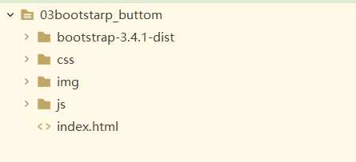
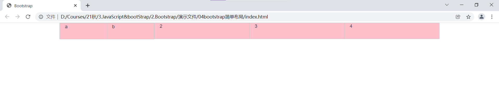
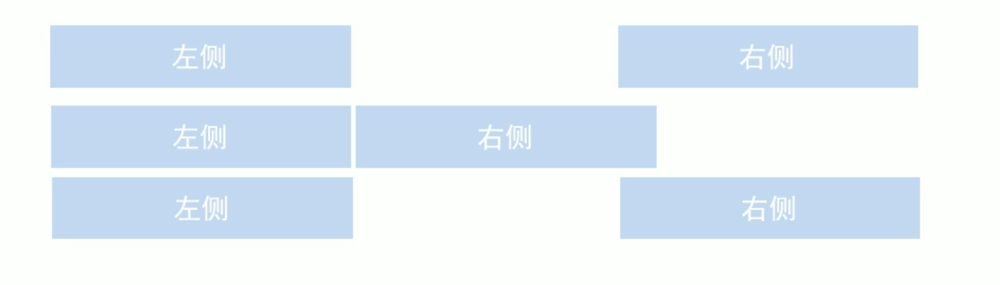
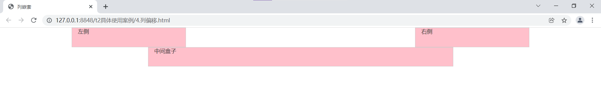
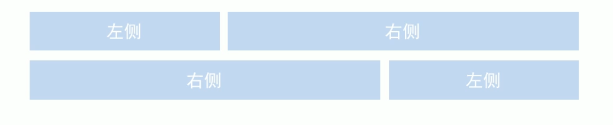
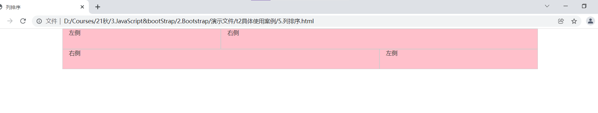

# Bootstrap

------

#### 1.响应式开发

##### （1）响应式开发原理

响应式开发就是通过媒体查询<font color='#BAOC2F'>针对不同宽度的设备</font>进行<font color='#BAOC2F'>布局和样式的设置</font>，从而适配不同设备的目的。

| 设备划分                 | 尺寸区间       |
| ------------------------ | -------------- |
| 超小屏幕（手机）         | <= 768xp       |
| 小屏设备（平板）         | 768px ~ 992px  |
| 中等屏幕（左面显示器）   | 992px ~ 1200px |
| 宽屏设备（大桌面显示器） | >= 1200px      |

##### （2）响应式布局容器

响应式需要一个<font color='#BAOC2F'>父级容器作为布局容器</font>，来<font color='#BAOC2F'>配合子集元素</font>来实现变化效果。

在不同屏幕下，通过<font color='#BAOC2F'>媒体查询</font>来改变这个布局容器的大小，最后改变其中的子元素的排列方式和大小，实现不同的页面布局和样式变化。

响应式尺寸划分：

| 屏幕类型                               | 设置宽度         |
| -------------------------------------- | ---------------- |
| 超小屏幕（手机，小于768px）            | 设置宽度为100%   |
| 小屏幕（平板，大于等于768px）          | 设置宽度为750px  |
| 中等屏幕（桌面显示器，大于等于992px）  | 宽度设置为970px  |
| 大屏幕（大桌面显示器，大于等于1200px） | 宽度设置为1170px |

#### 3.Bootstrap文件框架

Bootstarp来自Twitter是目前最受欢迎的前端框架，基于html、css和javaScript其更为灵活，使得Web开发更加快捷。

Bootstrap使用手册：https://getbootstrap.com/

|          步骤           |
| :---------------------: |
|  step1：创建文件夹结构  |
| step2：创建html骨架结构 |
| step3：引入相关样式文件 |
|   step4：书写页面内容   |



#### 4.Bootstarp布局容器：

> 注意：Bootstrp需要为页面内容和栅格系统包裹一个.containner容器，Bootstrap预先定义好了这个类。

##### （1）container类：

1. 响应式布局的容器（固定宽度）
2. 大屏（>=1200px）宽度定为1170px
3. 中屏（>=992px）宽度定为970px
4. 小屏（>=768px）宽度定为750px
5. 超小屏幕（100%）

##### （2）container-fluid类：

- 流式布局容器（百分百宽度）
- 占据全部视口（viewport）的容器
- 适合于<font color='#BAOC2F'>单独做移动端开发</font>

#### 5.Bootstrap栅格系统

gridsystems网格系统，是指将<font color='#BAOC2F'>页面布局划分为等宽的列</font>，然后通过列数的定义来<font color='#BAOC2F'>模块化页面布局</font>。

##### （1）栅格系统使用：

网格系统是通过一系列的行（row）与列（column）的组合来创建页面布局的，页面内容将被放在这些创建好的布局中。

|                     | 超小屏幕（手机<768px） | 小屏设备（平板>=768px） | 中等屏幕（>=992px） | 宽屏设备（>=1200px） |
| :-----------------: | :--------------------: | :---------------------: | :-----------------: | :------------------: |
| .conntainer最大宽度 |        自动100%        |          750px          |        970px        |        1170px        |
|       类前缀        |        .col-xs-        |        .col-sm-         |      .col-md-       |       .col-lg-       |
|  列（column）总数   |           12           |           12            |         12          |          12          |

注意：

1. 行（row）必须放到<font color='#BAOC2F'>container布局容器</font>里面
2. 要实现列的平均划分需要给列添加<font color='#BAOC2F'>类前缀</font>。
3. 每一列默认有左右15像素的padding值
4. 可以同时为一列指定多个设备类名，以便划分不同的份数。

```html
<!doctype html>
<html lang="zh-CN">
  <head>
    <meta charset="utf-8">
    <meta http-equiv="X-UA-Compatible" content="IE=edge">
    <meta name="viewport" content="width=device-width, initial-scale=1">
    <!--[if lt IE 9]>
      <script src="https://cdn.jsdelivr.net/npm/html5shiv@3.7.3/dist/html5shiv.min.js"></script>
      <script src="https://cdn.jsdelivr.net/npm/respond.js@1.4.2/dest/respond.min.js"></script>
    <![endif]-->
	<!-- HTML5 shim 和 Respond.js 是为了让 IE8 支持 HTML5 元素和媒体查询（media queries）功能 -->
	<link rel="stylesheet" href="bootstrap-3.4.1-dist/css/bootstrap.min.css"/>
	<title>Bootstrap</title>
	<style type="text/css">
		* {
			margin: 0;
			padding: 0;
		}
		[class^="col"] {
			border: 1px solid #ccc;
		}
		.container .row:nth-child(1) {
			background-color: pink; col-sm-6
		}
	</style>
  </head>
  <body>
	  <div class="container">
		  <div class="row">
			  <div class="col-lg-3 col-md-4 col-sm-6 col-xs-12">1</div>
			  <div class="col-lg-3 col-md-4 col-sm-6 col-xs-12">2</div>
			  <div class="col-lg-3 col-md-4 col-sm-6 col-xs-12">3</div>
			  <div class="col-lg-3 col-md-4 col-sm-6 col-xs-12">4</div>
		  </div>
		  <!-- 如果孩子的份数相加等于12，则占满整个contanner -->
		  <div class="row">
			  <div class="col-lg-6">1</div>
			  <div class="col-lg-2">2</div>
			  <div class="col-lg-2">3</div>
			  <div class="col-lg-2">4</div>
		  </div>
		  <!-- 如果孩子的份数相加小于12，则占不满整个contanner -->
		  <!-- 如果孩子的份数相加大于12，则多余的份数会另起一行 -->
	  </div>
  </body>
</html>
```

##### （2）栅格系统列嵌套：

```html
<!doctype html>
<html lang="zh-CN">
	<head>
		<meta charset="utf-8">
		<meta http-equiv="X-UA-Compatible" content="IE=edge">
		<meta name="viewport" content="width=device-width, initial-scale=1">
		<!--[if lt IE 9]>
			<script src="https://cdn.jsdelivr.net/npm/html5shiv@3.7.3/dist/html5shiv.min.js"></script>
			<script src="https://cdn.jsdelivr.net/npm/respond.js@1.4.2/dest/respond.min.js"></script>
		<![endif]-->
		<!-- HTML5 shim 和 Respond.js 是为了让 IE8 支持 HTML5 元素和媒体查询（media queries）功能 -->
		<link rel="stylesheet" href="bootstrap-3.4.1-dist/css/bootstrap.min.css" />
		<title>列嵌套</title>
		<style type="text/css">
			* {
				margin: 0;
				padding: 0;
			}

			[class^="col"] {
				border: 1px solid #ccc;
			}

			.row>div {
				height: 50px;
				background-color: pink;
			}
		</style>
	</head>
	<body>
		<div class="container">
			<div class="row">
				<div class="col-lg-3 col-md-4 col-sm-6 col-xs-12">
					<!-- 注意:列嵌套最好添加一个row行，这样可以取消父元素的padding值（而且高度自动修改） -->
					<div class="row">
						<div class="col-md-6">a</div>
						<div class="col-md-6">b</div>
					</div>
				</div>
				<div class="col-lg-3 col-md-4 col-sm-6 col-xs-12">2</div>
				<div class="col-lg-3 col-md-4 col-sm-6 col-xs-12">3</div>
				<div class="col-lg-3 col-md-4 col-sm-6 col-xs-12">4</div>
			</div>
		</div>
	</body>
</html>
```



##### （3）栅格系统列偏移：

使用`.col-md-offset-*`类可以将列向右侧偏移，这些类实际是通过使用`*`选择器为当前元素增加了左侧的边距（margin）。



```html
<!doctype html>
<html lang="zh-CN">
	<head>
		<meta charset="utf-8">
		<meta http-equiv="X-UA-Compatible" content="IE=edge">
		<meta name="viewport" content="width=device-width, initial-scale=1">
		<!--[if lt IE 9]>
      <script src="https://cdn.jsdelivr.net/npm/html5shiv@3.7.3/dist/html5shiv.min.js"></script>
      <script src="https://cdn.jsdelivr.net/npm/respond.js@1.4.2/dest/respond.min.js"></script>
    <![endif]-->
		<!-- HTML5 shim 和 Respond.js 是为了让 IE8 支持 HTML5 元素和媒体查询（media queries）功能 -->
		<link rel="stylesheet" href="bootstrap-3.4.1-dist/css/bootstrap.min.css" />
		<title>列嵌套</title>
		<style type="text/css">
			* {
				margin: 0;
				padding: 0;
			}

			[class^="col"] {
				border: 1px solid #ccc;
			}

			.row div {
				height: 50px;
				background-color: pink;
			}
		</style>
	</head>
	<body>
		<div class="container">
			<div class="row">
				<div class="col-md-3">左侧</div>
				<div class="col-md-3 col-md-offset-6">右侧</div>
			</div>
			<div class="row">
				<div class="col-md-8 col-md-offset-2">中间盒子</div>
			</div>
		</div>
	</body>
</html>
```



> 注意：本质上为盒子做的偏移是在盒子的<font color='#BAOC2F'>左侧添加上一个margin值</font>。

##### （4）栅格系统列排序：

通过使用`.col-md-push-*`和`.col-md-pull-*`类就可以很容易的改变列（column）的顺序。



```html
<!doctype html>
<html lang="zh-CN">
	<head>
		<meta charset="utf-8">
		<meta http-equiv="X-UA-Compatible" content="IE=edge">
		<meta name="viewport" content="width=device-width, initial-scale=1">
		<!--[if lt IE 9]>
      <script src="https://cdn.jsdelivr.net/npm/html5shiv@3.7.3/dist/html5shiv.min.js"></script>
      <script src="https://cdn.jsdelivr.net/npm/respond.js@1.4.2/dest/respond.min.js"></script>
    <![endif]-->
		<!-- HTML5 shim 和 Respond.js 是为了让 IE8 支持 HTML5 元素和媒体查询（media queries）功能 -->
		<link rel="stylesheet" href="bootstrap-3.4.1-dist/css/bootstrap.min.css" />
		<title>列排序</title>
		<style type="text/css">
			* {
				margin: 0;
				padding: 0;
			}

			[class^="col"] {
				border: 1px solid #ccc;
			}

			.row div {
				height: 50px;
				background-color: pink;
			}
		</style>
	</head>
	<body>
		<div class="container">
			<div class="row">
				<div class="col-md-4">左侧</div>
				<div class="col-md-8">右侧</div>
			</div>
			<div class="row">
				<div class="col-md-4 col-md-push-8">左侧</div>
				<div class="col-md-8 col-md-pull-4">右侧</div>
			</div>
		</div>
	</body>
</html>
```



##### （5）栅格系统响应式工具：

为了加快对移动设备友好的页面开发工作，<font color='#BAOC2F'>利用媒体查询功能</font>，并使用这些工具类可以方便的<font color='#BAOC2F'>针对不同设备展示 or 隐藏页面内容</font>。

| 类名       | 超小屏 | 小屏 | 中屏 | 大屏 |
| ---------- | ------ | ---- | ---- | ---- |
| .hidden-xs | 隐藏   | 可见 | 可见 | 可见 |
| .hidden-sm | 可见   | 隐藏 | 可见 | 可见 |
| .hidden-md | 可见   | 可见 | 隐藏 | 可见 |
| .hidden-ld | 可见   | 可见 | 可见 | 隐藏 |

与之相反的是`visible-xs`、`visible-sm`、`visible-md`、`visible-lg`

> 注意：具体的Bootstrap其他（按钮、表单、表格）请参考bootstrap文档。


